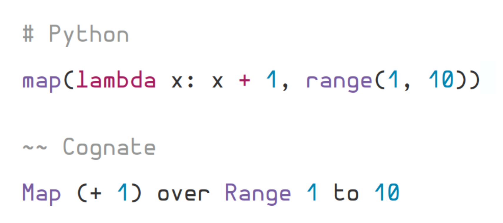

<h1 align="center"> The Cognate programming language </h1>
<p align="center">


</p>

Cognate is a small dynamic quasi-concatenative language for functional programming. Cognate aims to express complex programs in a simple and readable way through its unique syntax, which emphasises embedding comments into statements. This makes programs very readable and helps a programmer better express their intentions.


### Cognate is readable
Cognate's compiler ignores words beginning with lowercase letters, allowing comments and code to be interwoven. This 'informal syntax' being optional allows Cognate to be verbose where detail is needed and concise where it isn't.



### Cognate is efficient
CognaC (the Cognate Compiler) compiles Cognate sources directly into C. This produces very small and rather fast binaries, allowing Cognate to outperform most dynamic languages. This also makes Cognate a candidate for scripting in embedded environments, such as microcontrollers.

### Cognate is simple
Cognate has only a handful of syntax elements. This makes the language very consistent and easy to learn. In future this will allow me to elegantly introduce metaprogramming constructs.

### Cognate is functional
Cognate is designed for functional programming - but does not require a PhD in discrete mathematics to use. While Cognate is oriented around first-class functions, no restrictions are placed on IO - making debugging and refactoring less headache-inducing.

### Cognate is powerful
Cognate is a stack-oriented programming language. This means that all intermediary values reside in a stack data structure. This allows powerful features such as:

* Multiple return values
* Point-free functions
* Operation chaining

### Web playground
Check out the interactive web playground - it runs Cognate programs client-side in the browser. It also has intelligent syntax highlightung, code folding, and error reporting in the editor.

Playground: [https://cognate-playground.hedy.dev](https://cognate-playground.hedy.dev)

Source: [https://github.com/hedyhli/cognate-playground](https://github.com/hedyhli/cognate-playground)

### Building Cognate
Currently, Cognate will run on Linux and MacOS systems. If you use Windows, then you can install Cognate on the Windows Subsystem for Linux. To build Cognate, you will need `make`, `flex`, `bison`, and a C compiler (currently supported are GCC, Clang, and TCC). After installing these, simply run:
```
make
```
If that succeeds, install the compiler with:
```
make install
```
This installs cognate to the `.local` prefix. To install to a different directory:
```
make PREFIX=/my/prefix/dir install
```
You should then run the test script to test Cognate's functionality. This should work regardless of operating system.
```
make test -j
```
If the tests all pass (they should!), you can then try running some of the included demo programs:
```
cognac examples/fizzbuzz.cog
./examples/fizzbuzz
```

[Here](https://cognate-lang.github.io/learn.html) is an work-in-progress introduction to the language.
