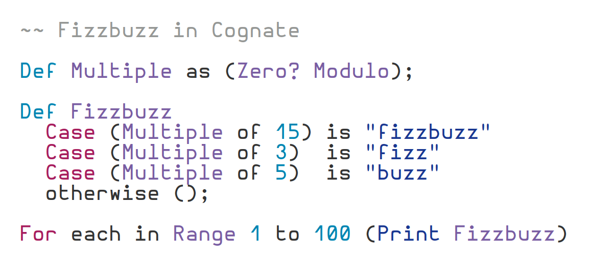
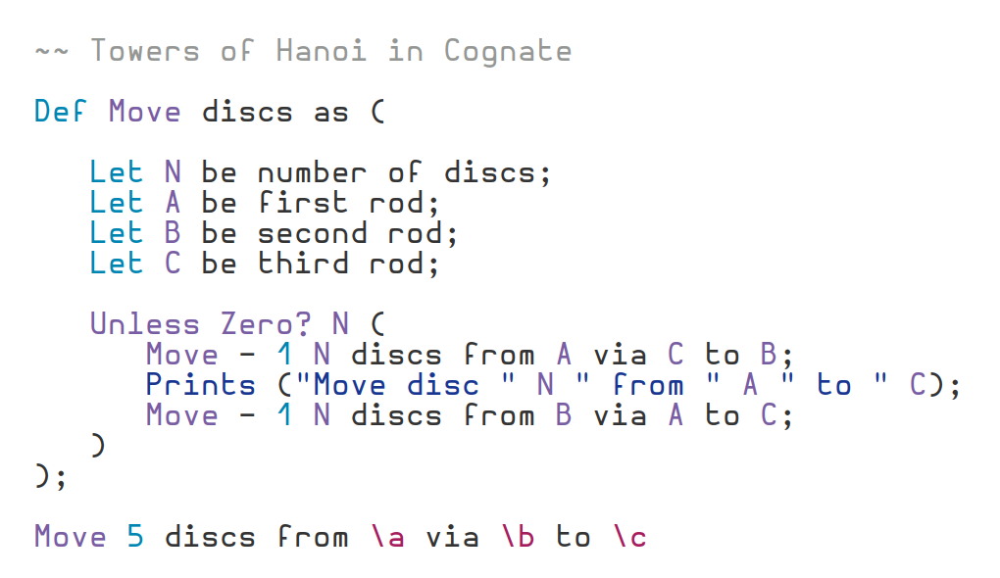
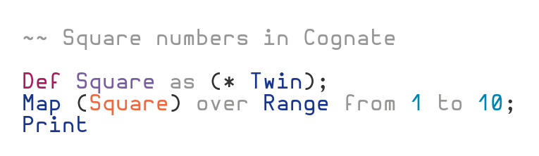
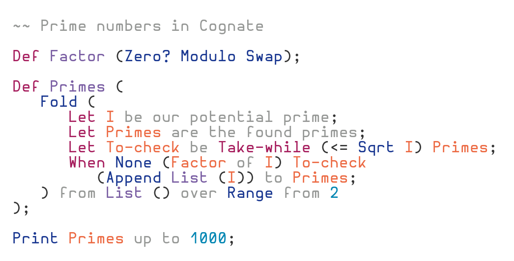

<h1 align="center"> Cognate </h1>
<h2 align="center"> Readable and concise concatenative programming </h2>
<p align="center">


</p>



Cognate is a project aiming to create a human readable programming language with as little syntax as possible. Where natural language programming usually uses many complex syntax rules, instead Cognate takes them away. What it adds is simple, a way to embed comments into statements.



As you can see, Cognate ignores words starting with lowercase letters, allowing them to be used to describe functionality and enhance readability. This makes Cognate codebases intuitive and maintainable.



Cognate is a stack-oriented programming language similar to Forth or Factor, except statements are evaluated right to left. This gives the expressiveness of concatenative programming as well as the readability of prefix notation. Statements can be delimited at arbitrary points, allowing them to read as sentences would in English.



Cognate borrows from other concatenative languages, but also adds unique features of its own.

- Point-free functions
- Operation chaining
- Multiple return values
- Combinator oriented programming
- Predicate pattern matching
- Natural language programming

Interested? Read the [tutorial](/learn/), and check out one of Cognate's implementations:

- CognaC (this repository) is the original compiler -- it performs type inference and produces efficient binaries.
- [Cognate Playground](https://cognate-playground.hedy.dev/) (developed by [hedyhli](https://github.com/hedyhli)) runs Cognate programs in a web browser.
- [Cogni](https://github.com/dragoncoder047/cogni) (developed by [dragoncoder047](https://github.com/dragoncoder047)) interprets Cognate programs and is optimised to run on microcontrollers.

## Cognac

CognaC is the original Cognate compiler, it compiles Cognate programs into efficient C, which is then compiled into a small executable. As well as all language features, CognaC...

- Performs type inference (for optimisation and error reporting at compile time)
- Features a generational garbage collector
- Prints pretty error messages and backtraces (in debug mode)
- Approaches the speed of C for some small programs

### Building Cognate
Currently, Cognate will run on Linux and MacOS systems. If you use Windows, then you can install Cognate on the Windows Subsystem for Linux. To build Cognate, you will need `make`, `flex`, `bison`, and a C compiler (currently supported are GCC, Clang, and TCC). After installing these, simply run:
```
make
```
If that succeeds, install the compiler with:
```
make install
```
This installs cognate to the `.local` prefix. To install to a different directory:
```
make PREFIX=/my/prefix/dir install
```
You should then run the test script to test Cognate's functionality. This should work regardless of operating system.
```
make test -j
```
If the tests all pass (they should!), you can then try running some of the included demo programs:
```
cognac examples/fizzbuzz.cog
./examples/fizzbuzz
```

[Here](https://cognate-lang.github.io/learn.html) is an work-in-progress introduction to the language.
